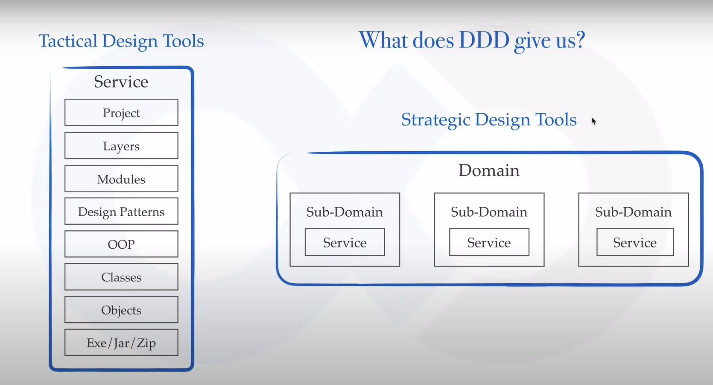
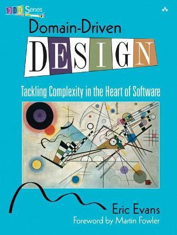

# what is domain driven design
In the past there is a very smart person called Eric Evans which basically wrote a book called domain driven design in 2003 and what he did is that he took all the best practices of developing his software and created a book around it and coined some new terms which are very common these days. In today's architecture domain driven design is well respected in architects community so what is it.

Eric Evans says
> we are developing a software our focus shouldn't be primarily on technology it should be primarily on business or whatever activity we are trying to assist with the software the domain domain is the business that we are trying to solve or trying to assist with that software now this domain can be any business to mean for example it can be aviation domain it can be railways it can be banking it can be insurance it can be ecommerce or any any sort of domain I think you get the idea and second line that he says is that.
>  
> specifically we prose that by trying to develop models of that domain and make our software conform to that.

In simple term "domain different design is a way of looking at software from top-down".

From a software engineers perspective when you write the code and everything is done when you deploy it to production you either have exe jar or zip depending on whether you have node, Python, dotnet or Java after that you  have a bit of abstraction you have objects or methods then abstracting those you have classes and then then you have object-oriented principles which guides you to write classes like interfaces and inheritance that sort of thing then you have even one more layer of abstraction that is design patterns which tell you how to how to design your code using those OPA principles and your classes then you have modules you basically break down your code into modules and each of those modules will be following some sort of design pattern then you have layers you can you have MVC layers you have services you have controllers you have dow layers things like that and then you have your project so this is a typical project architecture and most of the software developers are only familiar or only think about this whole thing as a software.

Now if this is not a desktop application if it is going to be deployed on web there are percent chances either this is part of a big system or a big infrastructure and it is being used as a service or even if you are selling this product live on internet to customers they are using it as a service so this will be basically more or less a service so what we want is that we want to go up this layer what is above this we want to go up until the top you have many services then all of those services are a part of infrastructure they are trying to solve a bigger problem and that problem is generally a business problem a business domain like we talked about domain can be like e-commerce domain or insurance domain banking domain right and all of these services is solving some part of that domain and these are called subdomains so now subdomains will be like if your domain is an e-commerce domain and your sub domain will be like product domain or customer domain or shipping domain things like that so now what does domain driven design has to do with all of this so domain driven design as I said is a way to look at things from top down what do we have on top we have domain on top domain driven design gives us two kinds of tools one is called strategic design tools which helps us to solve all the problems that are related to software modeling the domain this part that you see here this and second kind of tools that DDD gives us is tactical design tools that helps us to solve this part of the problem now many of you specially software engineers will be inclined towards tactical design tools but let me tell you this this strategic design tools are the most important tools that you can have and if you get a grab on those it will really make you a good software architect or developer or manager. Anyone who is experienced enough will always give more importance to strategic design tools now you'll say why should I learn domain-driven design my answer first answer would be straight away to improve your craft as a software developer you want to grow you want to take responsibility you want to design things from scratch basically such that if you design software tomorrow no one should be able to do something like this next is so it's not customers shop to know what they want you should be able to figure out what features or what problems is this customer going to face in future any new feature that you want to give them it should come from your site now this is a good one so your architecture might be fabulous but it's the end user ultimately who decides whether your system is fabulous or not so you don't want to be doing this tomorrow to your customers and the last one is a system that doesn't solve the business needs is of no use to anyone no matter how pretty it looks or how well architecture its infrastructure is let's take an example of Windows  Windows  I am pretty sure the architecture of Windows  was way better than Windows  and it looked pretty as well it tried to give us features that we really didn't need and like this one you don't want your customers to react to your software like that  

Refrence:

You can get the PDF of the book below.

> ## The content of the book.
> 
> I. Putting the Model to Work.
> 
> II. Building Blocks of a Model-Driven Design.
> 
> III. Supple	Design.
> 
> IV. Context	Mapping for	Strategic Design.
> 
> V. Distillation	for	Strategic Design.
> 
> VI. Large-scale	Structure for Strategic	Design .