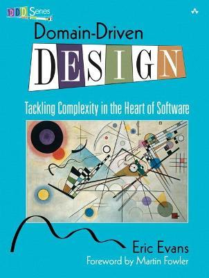

# What is domain-driven-design
## Introduction
In the past, there is a very smart person called Eric Evans who basically wrote a book called domain driven design in 2003, and what he did is he took all the best practices of developing his software and created a book around it, and coined some new terms which are very common these days. In today's architecture domain driven design is well respected in architects' communities so what is it.

# Definition

Eric Evans says: "we are developing software our focus shouldn't be primarily on technology it should be primarily on business or whatever activity we are trying to assist with the software the domain is the business that we are trying to solve or trying to assist with that software now this domain can be any business to mean for example it can be aviation domain it can be railways it can be banking it can be insurance it can be e-commerce or any sort of domain.
specifically, we prove that by trying to develop models of that domain and make our software conform to that."
In simple terms "Domain-Driven-Design is a way of looking at software from top to down".

# I. Putting the Model to Work.

Domain-Driven Design is an approach to the development of complex software in which we: 

1. Focus on the core domain. 

2. Explore models in a creative collaboration of domain practitioners and software practitioners. 

3. Speak a ubiquitous language within an explicitly bounded context. 

## Ubiquitous	Language
For first you write a sentence, 

And then you chop it small; 

Then mix the bits, and sort them out 

Just as they chance to fall: 

The order of the phrases makes 

No difference at all. 

—Lewis Carroll, “Poeta Fit, Non Nascitur” 

## Continuous	Integration

Once a bounded context has been defined, we must keep it sound. When a number of people are working in the same bounded context, there is a strong  tendency for the model to fragment. The bigger the team, the bigger the problem, but as few  as three or four people can encounter serious problems. Yet breaking down the system into  ever-smaller contexts eventually loses a valuable level of integration and coherency.

Therefore: 

Institute a process of merging all code and other implementation artifacts frequently, with  automated tests to flag fragmentation quickly. Relentlessly exercise the ubiquitous  language to hammer out a shared view of the model as the concepts evolve in different  people’s heads. 

 # II. Building Blocks of a Model-Driven Design. 

These patterns cast widely held best practices of object-oriented design in the light of domain-driven design. They guide decisions to clarify the model and to keep the model and implementation aligned with each other, each reinforcing the other’s effectiveness. Careful crafting the details of individual model elements gives developers a steady platform from which to explore models and to keep them in close correspondence with the implementation.  

## Layered Architecture 

In an object-oriented program, UI, database, and other support code often gets written directly into the business objects. Additional business logic is embedded in the behavior of UI widgets and database scripts. This happens because it is the easiest way to make things work, in the short run.

## Entities 

Many objects represent a thread of continuity and identity, going through a lifecycle, though their attributes may change. 

## Value Objects 

Some objects describe or compute some characteristic of a thing. Many objects have no conceptual identity. 

# III. Supple Design. 

To have a project accelerate as development proceeds—rather than get weighed down by its own legacy—demands a design that is a pleasure to work with, inviting to change. A supple design. 

Supple design is the complement to deep modeling. 

Developers play two roles, each of which must be served by the design. The same person might well play both roles—even switch back and forth in minutes—but the relationship to the code is different nonetheless. One role is the developer of a client, who weaves the domain objects into the application code or other domain layer code, utilizing capabilities of the design. A supple design reveals a deep underlying model that makes its potential clear. The client developer can flexibly use a minimal set of loosely coupled concepts to express a range of scenarios in the domain. Design elements fit together in a natural way with a result that is predictable, clearly characterized, and robust. 

Equally important, the design must serve the developer working to change it. To be open to change, a design must be easy to understand, revealing that same underlying model that the client developer is drawing on. It must follow the contours of a deep model of the domain, so most changes bend the design at flexible points. The effects of its code must be transparently obvious, so the consequences of a change will be easy to anticipate. 

* Making behavior obvious 

* Reducing the cost of change 

* Creating software developers to work with 

# IV. Context Mapping for Strategic Design. 

### bounded context  

A description of a boundary (typically a subsystem, or the work of a particular team) within which a particular model is defined and applicable. ### upstream-downstream 

A relationship between two groups in which the “upstream” group’s actions affect project success of the “downstream” group, but the actions of the downstream do not significantly affect projects upstream. (e.g. If two cities are along the same river, the upstream city’s pollution primarily affects the downstream city.) The upstream team may succeed independently of the fate of the downstream team  
 
### mutually dependent 

A situation in which two software development projects in separate contexts must both be delivered in order for either to be considered a success. (When two systems each rely on information or functionality of the other - something we would generally try to avoid  naturally we see the projects that build them as interdependent. Yet there are also mutually dependent projects where system dependencies run only one direction. When the depended-on system has little value without the dependent system and the integration with that system -perhaps because this is the only place it is used - then a failure to deliver the dependent system would be a failure of both projects.  

### free 

A software development context in which the direction, success or failure of development work in other contexts has little effect on delivery. 

# V. Distillation for Strategic Design. 

How do you focus on your central problem and keep from drowning in a sea of side issues? 

Distillation is the process of separating the components of a mixture to extract the essence in a form that makes it more valuable and useful. A model is a distillation of knowledge. With every refactoring to deeper insight, we abstract some crucial aspect of domain knowledge and priorities. Now, stepping back for a strategic view, this chapter looks at ways to distinguish broad swaths of the model and distill the domain model as a whole.  

# VI. Large-scale Structure for Strategic Design. 

In a large system without any overarching principle that allows elements to be interpreted i terms of their role in patterns that span the whole design, developers cannot see the forest for the trees. We need to be able to understand the role of an individual part in the whole without delving into the details of the whole. 

A “large-scale structure” is a language that lets you discuss and understand the system in broad strokes. A set of high-level concepts or rules, or both, establishes a pattern of design for an entire system. This organizing principle can guide design as well as aid understanding. It helps coordinate independent work because there is a shared concept of the big picture: how the roles of various parts shape the whole  

Therefore: 

Devise a pattern of rules or roles and relationships that will span the entire system and that allows some understanding of each part’s place in the whole—even without detailed knowledge of the part’s responsibility.  
 
In simple terms "Domain-Driven-Design is a way of looking at software from top to down".

# Refrence:

All the points and understanding are taken from the book, Interview of Eric Evans and from the Internet's different websites.

You can **Download** the PDF of the book below.

The End.